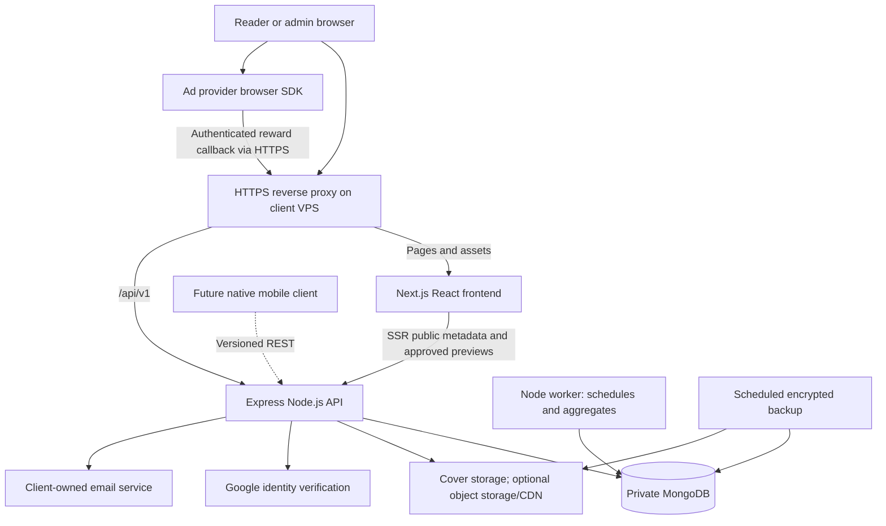

# MERN Architecture — Serial-Fiction Platform

Status: proposed implementation design derived from the contract. Required stack: MongoDB + Express + React/Next.js + Node.js. TypeScript, the repository layout, session mechanics and implementation defaults below are proposed choices, not additional contract clauses. Installed Phase 1 versions are pinned in manifests and the lockfile.

## 1. System structure

Use a modular monolith: one Express business API with domain modules, one Next.js frontend, and a small background worker sharing backend services. This keeps deployment manageable within the MVP while preserving a reusable mobile API.



The browser uses the same public origin for frontend and API. The reverse proxy routes `/api/v1/*` to Express and other application paths to Next.js. MongoDB is not internet-public. Next.js does not query MongoDB directly or duplicate entitlement logic. Shared frontend packages contain DTO/types, never database models, credentials or protected chapter content.

## 2. Proposed repository

```text
Story reading platform/
  apps/
    web/                         # React through Next.js
      src/app/                   # Public, account/reader, and admin route groups
      src/components/            # Reader, discovery and admin UI
      src/lib/                   # API client, theme and public metadata helpers
    api/                         # Node + Express
      src/modules/
        auth/ users/ stories/ chapters/ taxonomy/
        library/ reading/ comments/ discovery/
        ads/ unlocks/ settings/ media/ contact/
      src/middleware/            # Auth, role checks, validation, rate/error handling
      src/workers/               # Due publications, free conversion, trending
      src/config/
  packages/contracts/            # Safe request/response schemas and types
  tests/                         # Integration/security and end-to-end scenarios
  infra/                         # Proxy, process/container and backup configuration
  docs/                          # OpenAPI, schema, operations, acceptance records
  PROJECT_PLAN.md
  ARCHITECTURE.md
  PROJECT_CONTEXT.md
  AGENTS.md
```

The Phase 1 repository now exists. See docs/DATABASE.md and docs/DECISIONS.md for the implemented schema and refinements to this original proposal. Suggested implementation: TypeScript across web/API; a MongoDB ODM such as Mongoose; a minimal shared validation layer. Final editor, test tools and styling packages should be selected during scaffolding, keeping dependencies modest.

## 3. Frontend responsibilities and pages

| Area                 | Routes (proposed)                                           | Responsibilities                                                                              |
| -------------------- | ----------------------------------------------------------- | --------------------------------------------------------------------------------------------- |
| Public discovery     | `/`, `/discover`, `/genres/[slug]`, `/search`               | Browse, trending, new releases, filters and pagination                                        |
| Public story/chapter | `/stories/[slug]`, `/stories/[slug]/chapters/[chapterSlug]` | SSR metadata, prologue, table of contents and approved preview; reader shell on chapter route |
| Account              | `/sign-in`, `/sign-up`, `/library`, `/account`              | Authentication, library/bookmarks, preferences and confirmation settings                      |
| Reader               | Chapter route after authorization                           | Protected body, font/theme controls, progress, comments, ad slots and unlock state            |
| Admin                | `/admin/*`                                                  | Story/chapter editor, taxonomy, schedules, media, users/activity, comments and settings       |
| Static               | Agreed policy pages and `/contact`                          | Approved copy and validated contact submission                                                |

Use CSS variables for instant theme switching and responsive spacing. Store fonts/theme/size per account; a local initial preference can reduce visual flashing, but account settings remain authoritative after login. Preserve keyboard navigation, form editing and screen-reader access when applying copy deterrents to the narrative area.

Public SSR receives only explicit public DTOs. It never fetches full text for the purpose of hiding it. Fetch authorized full content separately from Express after authentication, with no persistent browser/service-worker cache. Do not place private text in generated HTML, RSC/hydration payloads, metadata, JSON-LD, analytics or build artifacts. This follows the data-minimization boundary described in the [Next.js data-security guidance](https://nextjs.org/docs/app/guides/data-security).

## 4. Domain modules and data model

All documents have IDs and timestamps. Relationships use references; paginate unbounded lists instead of embedding entire reading histories in users. The table describes proposed collections, not final schemas.

| Collection      | Main fields/relationships                                                                         | Essential constraints/indexes                                              |
| --------------- | ------------------------------------------------------------------------------------------------- | -------------------------------------------------------------------------- |
| users           | normalizedEmail, passwordHash or Google identity, role, status, preferences, matureConfirmation   | Unique normalized email; unique partial Google subject; searchable status  |
| sessions        | userId, hashed opaque token, expiresAt, revokedAt                                                 | Token lookup; TTL cleanup; explicitly check expiry/status on every request |
| stories         | title, slug, authorName, prologue, coverKey, classification, status, taxonomyIds                  | Unique slug; status/published date; supported search indexes               |
| chapters        | storyId, slug, title, order, status, publishAt, accessType, freeAt, previewPolicy, contentVersion | Unique story+slug and story+order; due-publication index                   |
| chapterContents | chapterId, sanitized narrative blocks, derived word count, version                                | Unique chapterId; accessed only by protected service/admin paths           |
| chapterPreviews | chapterId, approved excerpt, contentVersion, policyVersion                                        | Unique chapterId; regenerate/invalidate on content or policy changes       |
| taxonomy        | name, slug, facet, parentId                                                                       | Unique facet+slug; genre/subgenre hierarchy validation                     |
| libraryEntries  | userId, storyId, addedAt                                                                          | Unique user+story; user+addedAt                                            |
| bookmarks       | userId, chapterId, blockAnchor                                                                    | Unique user+chapter for MVP chapter bookmark; validate anchor              |
| readingProgress | userId, storyId, chapterId, blockAnchor, updatedAt                                                | Unique user+story; user+updatedAt                                          |
| comments        | userId, chapterId, plain/sanitized body, moderationStatus                                         | Chapter+status+createdAt; user+createdAt                                   |
| rewardSessions  | userId, chapterId, provider, nonceHash, status, expiresAt                                         | Unique nonce; status/expiry; bounded retention                             |
| rewardEvents    | provider, transactionId, sessionId, verification outcome                                          | Unique provider+transactionId; retry/reconciliation status                 |
| unlocks         | userId, chapterId, rewardEventId, grantedAt                                                       | Unique user+chapter; never expire as a browser session does                |
| readingEvents   | userId, chapterId, storyId, dayBucket                                                             | Unique user+chapter+day; date index for rolling trends                     |
| trendingStats   | storyId, windowEnd, score                                                                         | Unique storyId; score ordering                                             |
| settings        | preview defaults, cover/ad configuration, public site settings                                    | Unique setting key; validate allowed values                                |
| auditLogs       | adminId, action, target, outcome                                                                  | Target/time and actor/time; restricted access and retention                |

Taxonomy facets distinguish genre/subgenre, trope, and content descriptor; editable tags can be assigned a defined facet. Seed the contract's examples without hard-coding UI choices: Enemies to lovers, Friends to lovers, Fake relationship, Forced relationship/marriage, Slow burn, Love triangle, Second chance romance, Love after marriage, Love after baby, Arranged marriage, Secret relationship/romance, Unrequited love, Revenge, Regret, Angst, Contemporary, Historical, Dark romance, Young adult, Paranormal, High school romance, Werewolf romance, Mafia romance, Billionaire romance and Forbidden romance. Confirm final facet assignments with the client.

Normalize Unicode/search inputs and implement bounded, indexed queries. Validate search relevance with actual Bengali/English samples before choosing a text-search method; do not assume a database text index supplies Bengali stemming. Avoid unbounded user-provided regex scans. Initial search can use normalized searchable metadata and exact facet filters; an external search engine is not assumed.

Proposed trending rule: rolling seven-day unique daily reader/chapter events plus three times new library additions. Exclude unpublished stories and obvious abusive activity; record counted reads only after authorized content access, deduplicate and rate-limit them. Recompute on a schedule; confirm formula with the client.

Account suspension invalidates sessions and is checked on every private request. Admin deletion must apply the agreed cascade/anonymization policy to comments, history, rewards and personal data; never leave orphaned active sessions. Record required deletion/retention decisions before implementing permanent deletion.

## 5. Access control and preview policy

| Requester                 | Published story metadata / permitted preview  | Full free chapter                      | Full locked chapter                                          | Admin operations |
| ------------------------- | --------------------------------------------- | -------------------------------------- | ------------------------------------------------------------ | ---------------- |
| Visitor                   | Yes, subject to mature-content policy         | No                                     | No                                                           | No               |
| Active reader             | Yes                                           | Yes, after applicable age confirmation | Only with own durable unlock and applicable age confirmation | No               |
| Suspended/deleted account | Only what a visitor may see without a session | No                                     | No                                                           | No               |
| Super admin               | Yes                                           | Yes through authorized admin/read path | Yes through authorized admin/read path                       | Yes              |

Drafts/future scheduled chapters have no public preview or public full-content access. Admin draft preview is a separate protected, non-cacheable operation. An existing unlock does not override suspension, unpublishing or the age gate.

Express evaluates: authenticated active account → publication visibility → classification confirmation → effective free status or durable unlock → return body. Effective free status includes an elapsed `freeAt`. Use this single policy service for API requests, tokens and future clients.

Preview settings support percentage or word count, proposed global default with chapter override. Generate excerpts on the server using language-aware word boundaries and safe block truncation. Reject negative/invalid settings, ensure a nonempty chapter preview cannot equal the entire chapter, and handle short/empty chapters explicitly. Recompute on edits or policy changes; never serve a stale longer preview after reducing the limit. Initial proposal: uncached/dynamic preview SSR to simplify correctness; later caching requires versioned keys and proven invalidation.

For Mature stories, proposed policy is metadata-only before confirmation, with narrative previews/full text gated. This needs client confirmation because the contract also calls for public previews on every chapter. Do not silently choose which requirement overrides the other. Confirmation is self-attestation, not identity verification; threshold and text remain to be supplied.

## 6. Authentication and API contracts

Proposed browser authentication: backend-managed opaque sessions in Secure, HttpOnly, SameSite cookies; MongoDB-backed session storage; CSRF/origin validation for cookie-authenticated writes. Hash passwords with a reviewed adaptive password hash. Google sign-in is verified server-side using issuer/audience/expiry/state/nonce checks as applicable; do not merge accounts just because an unverified browser email matches. Protect admin provisioning; never seed a production default password.

Future native clients can use bearer token authentication through a new auth adapter invoking the same user/authorization services; do not require Next.js-specific sessions inside domain logic. No native app is being built in this MVP. Session lifetime, account-recovery/email needs and secure linking flow should be finalized in Phase 1.

All business endpoints use `/api/v1`. Use explicit response field allowlists, schema validation, pagination, consistent error codes/request IDs, bounded request bodies and RBAC. Illustrative route families:

| Family       | Examples                                                                                                                     | Access                                                                                                 |
| ------------ | ---------------------------------------------------------------------------------------------------------------------------- | ------------------------------------------------------------------------------------------------------ |
| Auth         | `POST /auth/register`, `/auth/login`, `/auth/logout`; Google start/callback; `GET /auth/me`                                  | Public initiation; session protected where relevant                                                    |
| Discovery    | `GET /stories`, `/stories/:slug`, `/taxonomy`, `/trending`                                                                   | Public published metadata only                                                                         |
| Chapters     | `GET /chapters/:id/preview`, `/chapters/:id/content`                                                                         | Preview is filtered public/gated data; content is authorized                                           |
| Reader state | `GET/POST/DELETE /me/library`; bookmark routes; `PUT /me/progress/:storyId`, `/me/preferences`, `/me/content-confirmation`   | Active account; own records only                                                                       |
| Comments     | `GET/POST /chapters/:id/comments`; own-delete route                                                                          | Proposed read/write require chapter access to avoid public spoilers; admin moderation separate         |
| Rewards      | `POST /chapters/:id/reward-sessions`, `GET /reward-sessions/:id`, `POST /chapters/:id/unlock-token`                          | Active account; own session/entitlement                                                                |
| Callback     | `/ads/:provider/callback`                                                                                                    | Provider-authenticated signature, independent of browser login; HTTP method per provider specification |
| Admin        | `/admin/stories`, `/admin/chapters`, `/admin/users`, `/admin/taxonomy`, `/admin/comments`, `/admin/settings`, `/admin/media` | Super admin only                                                                                       |
| Contact      | `POST /contact`                                                                                                              | Public validated/rate-limited submission to configured client mailbox                                  |

Protect account and full-content responses with `Cache-Control: private, no-store`; disable shared proxy/CDN/Next caching for them. Do not log tokens, narrative bodies, password values or callback secrets. `robots.txt`/noindex are SEO controls, never authorization.

## 7. Rewarded-ad state machine

```mermaid
sequenceDiagram
    participant R as Reader browser
    participant A as Express API
    participant P as Ad provider
    participant D as MongoDB
    R->>A: Create reward session for locked chapter
    A->>D: Save account/chapter/nonce/expiry binding
    A-->>R: Opaque provider session data
    R->>P: Explicitly opt in and view rewarded ad
    P->>A: Signed server-to-server completion callback
    A->>A: Verify signature, timing, transaction and binding
    A->>D: Idempotently record reward and durable unlock
    R->>A: Poll own reward-session status
    A-->>R: Verified state and short-lived unlock token
    R->>A: Request full content with authenticated session
    A->>D: Recheck account, publication, age and entitlement
    A-->>R: Authorized chapter; ordinary ad placements remain
```

Session states: pending → verified, expired, failed or cancelled. Callback processing must follow provider retry/timestamp semantics; define a bounded late-arrival policy before integration. Verify signature against trusted provider keys, ad unit/reward type, nonce/session binding and transaction ID. Never accept account/chapter IDs supplied by an untrusted browser as callback authority.

Use a MongoDB transaction on a replica-set deployment for reward event, entitlement and session updates, with unique constraints to prevent duplicate credit. If hosting cannot support transactions, design and test an idempotent durable reconciliation path before selecting it; never mark a reward complete while losing its unlock. Retry transient failures safely. A repeat valid callback returns the prior outcome without issuing new credit.

The unlock record is permanent account entitlement. The short-lived signed unlock token is merely a delivery credential bound to user, chapter, expiry and audience; it cannot grant access without the active session and database checks. A returning entitled user can obtain a fresh token without watching another ad.

Provider selection is **unresolved**. Google's [web rewarded-ad sample](https://developers.google.com/publisher-tag/samples/display-rewarded-ad) documents browser events; its [AdMob SSV guide](https://developers.google.com/admob/android/ssv) is for mobile SDK platforms. These sources do not establish a browser S2S solution meeting this contract. Require provider-specific proof instead of assuming mobile SSV works on the website. If no compatible provider is available, keep premium locked and resolve the dependency/scope explicitly; never substitute browser-only verification.

## 8. Publishing, media, ads and background jobs

- Store dates in UTC; present admin schedules in an explicit timezone, initially proposed Asia/Dhaka. Worker polls due jobs with atomic claims/leases and retry safety. On restart, catch up overdue work; jobs must tolerate multiple executions. Read-time access checks enforce dates even when the worker is delayed.
- Editing/reordering chapters updates order safely without duplicate positions. Unpublishing withdraws public access and updates discovery/sitemap; editing text rebuilds previews and checks saved reading anchors.
- Accept only supported cover image formats, validate decoded content, constrain file size/dimensions, and resize/crop to the agreed fixed ratio. Use generated storage keys. Public covers may use CDN; chapter bodies and source manuscripts must never be public media objects.
- Use one persistence strategy initially: a backed-up persistent VPS media volume, or client-owned object storage if selected. A deploy/rebuild must not delete uploaded covers.
- Render ordinary ads between structured narrative blocks, with reserved space and no text overlays. Keep free/unlocked chapter reading usable when ordinary ads fail. Reward no-fill means no verified unlock, with a clear retry state.
- Contact endpoint validates length/email, limits spam and prevents mail-header injection; email credentials are server-only. Log delivery outcome without unnecessarily retaining message contents.

## 9. Protection and operations

Backend protections include role and ownership checks, input allowlists, sanitized content/comments, safe error handling, login/content/reward/contact rate limits, request-volume monitoring and basic bot response. Apply copy/right-click/keyboard restrictions only to the reading area; they are deterrents, not a substitute for access control. Visible watermark uses site name plus an optional opaque account reference, not the reader's email or other direct identity data.

Use HTTPS, secure cookies, careful proxy configuration, security headers/CSP compatible with approved ad/OAuth domains, restricted CORS where needed, least-privilege database access and non-root app processes. These operational choices align with [Express production security guidance](https://expressjs.com/en/advanced/best-practice-security/). Verify concrete library/API details at implementation time.

Proposed MVP deployment: one client-owned Linux VPS with reverse proxy and supervised web, API and worker processes; client-owned MongoDB deployment with restricted connectivity. Database hosting and provider cost are undecided. Keep staging and production databases/secrets separate. Include health/readiness endpoints and error/job/callback monitoring. No microservices, Kubernetes or Redis dependency is assumed initially; select shared durable rate-limit/session mechanisms appropriate to the final process count.

Proposed basic backup: daily encrypted database and media backup to a separate client-owned location, limited retention agreed with client, restore drill before handover. This is a proposed cadence, not a contractual recovery-time guarantee. Document backup failures, restore steps, deployment rollback and schema migration compatibility. Store secrets outside source/archives; share access through delegated roles and document revocation.

## 10. Verification strategy

Prioritize behavior that can lose access, money-like rewards or private content:

1. Unit tests for access policy, preview truncation, scheduling/free dates and callback validation.
2. API/database tests for role/ownership enforcement, unique unlocks, duplicate/concurrent callbacks, suspension, deletion, and restart-safe schedules.
3. End-to-end journeys: admin publish → discovery → sign-in → reader settings/library/progress → reward → unlocked reading → comment moderation.
4. Leak checks for anonymous and wrong-account HTML, hydration/RSC, full-content API, metadata, static assets and shared caches; include shortened-preview changes and unpublished content.
5. Responsive/browser checks, keyboard reading controls, long chapters, Unicode text, upload rejection, no-fill/timeout and contact delivery.
6. Production smoke test, actual provider callback verification, backup restore, deployment rollback and handover reproducibility.

Performance budgets and load-test concurrency will be set from content size and expected traffic in Phase 1. Record commands/results in future milestone evidence; the original planning task ran no application tests; subsequent Phase 1 verification is recorded in docs/MILESTONE_1.md.
